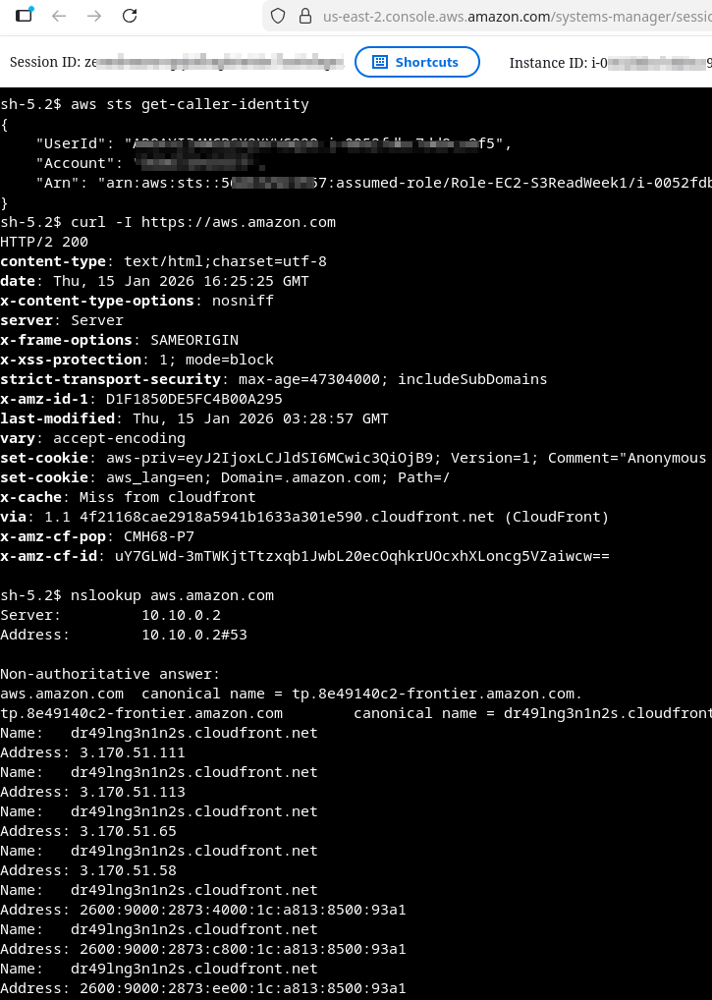

# AWS SAA – Week 1, Day 3 Lab (Completed)
## Private Subnet EC2 (No Public IP) + NAT Gateway Egress + SSM Access

**Goal:** Launch an EC2 instance in a **private subnet** (no public IP), keep it manageable via **SSM Session Manager**, and allow outbound internet access through a **NAT Gateway** in a public subnet.

---

## What You Built (Architecture)

```

Internet
|
v
Internet Gateway (IGW)
|
v
Public Subnet (10.10.1.0/24)
|
+--> NAT Gateway (Elastic IP)
|
v
Private Subnet (10.10.2.0/24)
|
v
EC2 Instance (NO public IP)
|
v
SSM Session Manager (outbound HTTPS via NAT)

````

---

## Success Criteria (Proof)
- ✅ EC2 is in **private subnet** and has **no public IPv4**
- ✅ EC2 appears in **Systems Manager → Fleet Manager** (managed node)
- ✅ You can connect using **Session Manager** (no SSH keys)
- ✅ From the private instance:
  - ✅ `aws sts get-caller-identity` shows assumed role
  - ✅ `curl` to the internet works (egress via NAT)
  - ✅ `dnf install` works (repo access via NAT)

---

# Prerequisites (Must Exist Before Day 3)

## VPC
- VPC: `vpc-saa-wk1`
- Public subnet: `subnet-saa-wk1-public-1a` (example: `10.10.1.0/24`)
- Private subnet: `subnet-saa-wk1-private-1a` (example: `10.10.2.0/24`)
- Internet Gateway: `igw-saa-wk1` attached to `vpc-saa-wk1`
- Public route table: `rt-saa-wk1-public`
  - Route: `0.0.0.0/0 → igw-saa-wk1`
  - Associated to: `subnet-saa-wk1-public-1a`
- VPC settings:
  - ✅ DNS resolution enabled
  - ✅ DNS hostnames enabled

## IAM
- Role: `Role-EC2-S3ReadWeek1`
- Attached policies:
  - ✅ `AmazonSSMManagedInstanceCore`
  - ✅ (Optional) your Week 1 S3 least privilege policy

## Security Group (SSM-only)
- SG: `saa-wk1-public-ssm`
- Inbound: none
- Outbound: allow all (default)

---

# Part 1 — Create NAT Gateway (Public Subnet)

## Step 1: Allocate an Elastic IP (EIP)
1. **VPC → Elastic IPs**
2. Click **Allocate Elastic IP address**
3. Click **Allocate**
4. Tag it:
   - Name: `eip-saa-wk1-nat`

## Step 2: Create NAT Gateway
1. **VPC → NAT gateways → Create NAT gateway**
2. Set:
   - Name: `nat-saa-wk1-1a`
   - Subnet: `subnet-saa-wk1-public-1a` ✅ (must be public)
   - Elastic IP: select `eip-saa-wk1-nat`
3. Click **Create NAT gateway**
4. Wait until **Status = Available**

---

# Part 2 — Private Route Table to NAT

## Step 3: Create private route table
1. **VPC → Route tables → Create route table**
2. Set:
   - Name: `rt-saa-wk1-private`
   - VPC: `vpc-saa-wk1`
3. Create

## Step 4: Add default route to NAT
1. Select `rt-saa-wk1-private`
2. **Routes → Edit routes → Add route**
3. Set:
   - Destination: `0.0.0.0/0`
   - Target: NAT Gateway → `nat-saa-wk1-1a`
4. Save

## Step 5: Associate private subnet
1. **Subnet associations → Edit subnet associations**
2. Select:
   - `subnet-saa-wk1-private-1a`
3. Save

> This is the most common failure point. If the private subnet is not associated, NAT will not be used.

---

# Part 3 — Launch EC2 in the Private Subnet

## Step 6: Launch instance
1. **EC2 → Instances → Launch instance**
2. Set:
   - Name: `ec2-saa-wk1-day3-private`
   - AMI: Amazon Linux 2023
   - Type: `t3.micro` (or `t2.micro`)
   - Key pair: **Proceed without a key pair** ✅

### Network settings (must be exact)
- VPC: `vpc-saa-wk1`
- Subnet: `subnet-saa-wk1-private-1a` ✅
- Auto-assign public IP: **Disabled**
- Security group: `saa-wk1-public-ssm`

### Advanced details
- IAM instance profile: `Role-EC2-S3ReadWeek1`

3. Launch

## Step 7: Validate it is private
Open the instance details and confirm:
- Public IPv4 address: **—** (blank)
- Private IP: `10.10.2.x`
- Subnet: `subnet-saa-wk1-private-1a`

---

# Part 4 — Confirm SSM Works (No SSH)

## Step 8: Confirm node is managed
1. **Systems Manager → Fleet Manager → Managed nodes**
2. Wait 1–5 minutes
3. Confirm instance appears and is **Online**

## Step 9: Connect via Session Manager
1. **Systems Manager → Session Manager → Start session**
2. Select: `ec2-saa-wk1-day3-private`
3. Start session

---

# Part 5 — Proof Tests (Run inside SSM session)

## Step 10: Confirm assumed role identity (STS)
```bash
aws sts get-caller-identity
````

✅ Expected:

* ARN contains:
  `assumed-role/Role-EC2-S3ReadWeek1/...`

## Step 11: Prove outbound internet via NAT

```bash
curl -I https://aws.amazon.com
```

✅ Expected:

* HTTP headers (200/301/302 OK)
* If it times out: NAT/route table is wrong

## Step 12: Prove package repo access works via NAT

Option A (install a small package):

```bash
sudo dnf -y install jq
jq --version
```

Option B (update):

```bash
sudo dnf -y update
```

✅ Expected:

* Install/update succeeds

---

# Troubleshooting (If Something Breaks)

## Not showing in Fleet Manager

Check in order:

1. Instance has IAM role attached: `Role-EC2-S3ReadWeek1`
2. Role includes `AmazonSSMManagedInstanceCore`
3. NAT gateway status = Available
4. Private route table:

   * Associated to `subnet-saa-wk1-private-1a`
   * Has `0.0.0.0/0 → nat-saa-wk1-1a`
5. VPC DNS resolution + hostnames enabled
6. Reboot instance (SSM agent can be stubborn)

## No internet from private instance

* Verify private subnet association to private route table
* Verify NAT gateway is in public subnet
* Verify public subnet has route to IGW

---

# Cleanup (Important: NAT Costs Money)

## Stop NAT charges (recommended after lab)

1. **VPC → NAT gateways**

   * Delete `nat-saa-wk1-1a`
2. **VPC → Elastic IPs**

   * Release `eip-saa-wk1-nat` (after NAT deletion completes)

## Optional cleanup

* Terminate `ec2-saa-wk1-day3-private`

> Keeping NAT running will incur ongoing cost. Delete it unless you need it for Day 4 work immediately.

---

# Day 3 Evidence (Paste into Notes)

Save these outputs:

1. `aws sts get-caller-identity`
2. `curl -I https://aws.amazon.com`
3. `jq --version` (or `dnf` success output)

✅ If all three were successful, Day 3 is complete.





